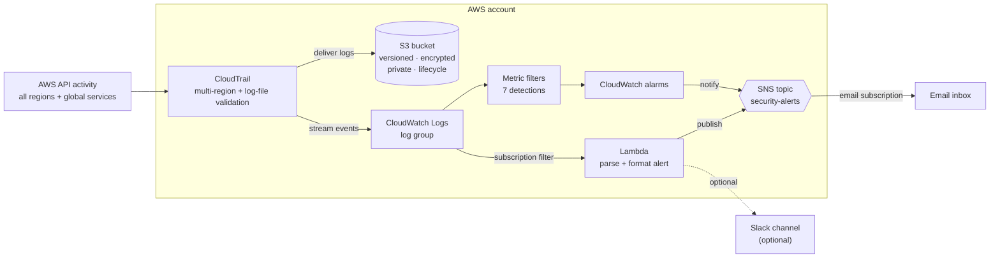

## Architecture




## Skills / Tech

* **AWS CloudTrail** — multi-region trail with log-file validation
* **Amazon S3** — versioned, encrypted (SSE-S3), private, lifecycle-managed log bucket
* **Amazon CloudWatch Logs** — log group, metric filters, subscription filter
* **Amazon CloudWatch Alarms** — 7 CIS-aligned security detections
* **AWS Lambda (Python 3.12)** — event parsing & formatted alerting (stdlib + boto3)
* **Amazon SNS** — email fan-out (+ optional Slack webhook)
* **AWS IAM** — least-privilege roles & policies, confused-deputy guards
* **Terraform** (>= 1.5, AWS provider ~> 5.0) — modular IaC with `for_each`, `default_tags`, validations
* **Security engineering** — CIS AWS Foundations Benchmark detections, threat detection & alerting

## What gets created

| Area | Resources |
| --- | --- |
| Audit storage | S3 bucket (versioning, SSE-S3, public-access block, lifecycle, TLS-only + confused-deputy bucket policy) |
| Audit capture | Multi-region CloudTrail with log-file validation → S3 **and** CloudWatch Logs |
| Detection | 7 CloudWatch Logs metric filters + 7 alarms |
| Alerting | SNS topic + email subscription; Python Lambda (SNS + optional Slack) |
| Access | IAM roles for CloudTrail→CW Logs and the Lambda (least privilege) |

See [`docs/detections.md`](docs/detections.md) for what each alarm detects and why
it matters, and [`docs/architecture.md`](docs/architecture.md) for the design.

## Repository layout

```
.
├── terraform/                 # All infrastructure as code
│   ├── versions.tf            # Terraform & provider version pins
│   ├── providers.tf           # AWS provider, default_tags, shared locals
│   ├── variables.tf           # Inputs (only alarm_email is required)
│   ├── s3.tf                  # CloudTrail log bucket + security controls
│   ├── cloudtrail.tf          # Multi-region trail + CW Logs group
│   ├── cloudwatch_alarms.tf   # 7 detections via for_each (filters + alarms)
│   ├── sns.tf                 # SNS topic, email subscription, topic policy
│   ├── lambda.tf              # Lambda, log group, permission, subscription filter
│   ├── iam.tf                 # Least-privilege IAM roles & policies
│   ├── outputs.tf             # Useful outputs
│   └── terraform.tfvars.example
├── src/lambda/handler.py      # Alerting Lambda (stdlib + boto3)
├── docs/                      # architecture.md, deployment.md, detections.md
├── diagrams/architecture.mmd  # Mermaid source for the diagram above
└── screenshots/               # Add console screenshots after deploying
```

## Prerequisites

* Terraform >= 1.5 and an AWS account with credentials configured
  (`aws configure` or `AWS_*` environment variables)
* Permissions to create CloudTrail, S3, CloudWatch, SNS, Lambda, and IAM resources
* An email address for alerts (and optionally a Slack Incoming Webhook)

## Deploy / Run

```bash
cd terraform
cp terraform.tfvars.example terraform.tfvars      # set at least alarm_email
# optional secret: export TF_VAR_slack_webhook_url="https://hooks.slack.com/services/..."

terraform init
terraform validate
terraform plan
terraform apply
```


## Teardown / Cleanup

```bash
cd terraform
terraform destroy
```

The log bucket uses `force_destroy = false` to protect the audit trail, so empty
it first if you truly want it gone:

```bash
aws s3 rm "s3://$(terraform output -raw cloudtrail_s3_bucket)" --recursive
terraform destroy
```


## License

[MIT](LICENSE) © 2026 Janani Mukkoti
