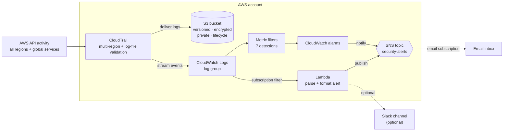

# Architecture

## Overview

The lab builds a self-contained **detect-and-alert** pipeline on AWS. CloudTrail
captures API activity across every region; CloudWatch Logs turns that stream into
real-time signals; metric-filter alarms and a formatting Lambda both publish to a
single SNS topic that notifies humans by email (and optionally Slack).

## Components

| Component | Terraform file | Responsibility |
| --- | --- | --- |
| S3 log bucket | `s3.tf` | Durable, immutable, encrypted store for CloudTrail log files. |
| CloudTrail | `cloudtrail.tf` | Multi-region trail with log-file validation; delivers to S3 + CW Logs. |
| CloudWatch log group | `cloudtrail.tf` | Real-time event stream for filters and the Lambda. |
| Metric filters + alarms | `cloudwatch_alarms.tf` | 7 CIS-style detections; alarm on match and notify SNS. |
| SNS topic + subscription | `sns.tf` | Fan-out of alerts to email (and the topic policy for CloudWatch). |
| Alerting Lambda | `lambda.tf`, `src/lambda/handler.py` | Parses events and sends human-readable alerts to SNS/Slack. |
| IAM roles/policies | `iam.tf` | Least-privilege roles for CloudTrail→CW Logs and the Lambda. |

## Data flow

1. **Capture** — Any principal makes an AWS API call in any region. CloudTrail
   records the management event (and global-service events such as IAM/STS).
2. **Deliver** — CloudTrail writes log files to the S3 bucket (long-term audit)
   and streams the same events to a CloudWatch Logs log group (real time).
3. **Detect** — Metric filters on the log group match security-relevant patterns
   and increment custom metrics. Alarms watch those metrics.
4. **Enrich** — A subscription filter forwards selected events to the Lambda,
   which decodes the gzip/base64 payload, classifies severity, and formats a
   concise message.
5. **Notify** — Both the alarms and the Lambda publish to the SNS topic, which
   emails subscribers (and the Lambda optionally posts to Slack).

## Design decisions

* **Two parallel notification paths.** Metric alarms give reliable,
  always-on coverage of all 7 detections. The Lambda adds rich, human-readable
  context (who/what/where/error) for the highest-severity events. Both converge
  on one SNS topic so there is a single place to manage subscriptions.
* **`for_each` over a detections map.** Filters and alarms are generated from one
  data structure (`local.detections`), keeping the code DRY and making it trivial
  to add or tune a detection.
* **Least privilege.** The CloudTrail role can only write to its log group's
  streams; the Lambda role can only write its own logs and publish to the one SNS
  topic. Both assume-role policies use `aws:SourceArn` confused-deputy guards.
* **Confused-deputy & TLS protections on S3.** The bucket policy pins access to
  this trail's ARN and denies non-TLS requests, on top of a full public-access
  block and SSE.
* **Deterministic naming.** Resource names derive from `project_name` +
  `environment`; the globally-unique S3 bucket name includes the account ID.
* **No hard dependency on KMS.** SSE-S3 (`AES256`) keeps the lab easy to run;
  `docs/detections.md` documents the KMS upgrade path for production.

## Assumptions & limitations

* Single-account, single-region control plane (the **trail** is multi-region, but
  the log group, alarms, Lambda, and bucket live in `aws_region`).
* Email subscriptions require manual confirmation (an AWS requirement).
* The Lambda subscription filter targets high-severity events by default to
  control cost/noise; widen it via `lambda_subscription_filter_pattern`.
